# Project Statement: Smart Campus Vision & Issue Vigilance System

## 1. Problem Statement
Traditional university campus complaint and facility management systems suffer from persistent inefficiencies, including manual, subjective reporting, ambiguous issue descriptions, lack of objective visual evidence, and zero automated prioritization. Facilities personnel are often inundated with redundant, unverified, or poorly documented complaints, while students experience prolonged delays and a lack of transparency regarding the status of critical maintenance issues (e.g., structural wall cracks, electrical failures, lab equipment breakage, or sanitation hazards).

Without an automated mechanism to validate photo clarity, assess physical defect severity, and categorize issues in real time, campus maintenance teams struggle to allocate resources effectively, leading to safety hazards, asset depreciation, and diminished student satisfaction.

---

## 2. Scope of the Project

### 2.1 In-Scope Capabilities
- **Role-Based Access Control & User Management**: Secure student self-registration, credential authentication, session isolation, and administrative governance.
- **Automated Computer Vision Defect Inspection**:
  - Image quality and blur detection using Laplacian variance $\text{Var}(\nabla^2 I)$ to reject unreadable or obscured submissions.
  - Adaptive Canny edge detection, Otsu thresholding, and morphological contour analysis to detect physical fissures, debris clusters, and surface anomalies.
  - Calculation of an objective Defect Severity Score ($0.0 - 100.0\%$) and automated priority recommendation (Low, Medium, High).
  - Generation of annotated visual inspection images with bounding boxes, contour overlays, and a metadata HUD banner.
- **Complaint Lifecycle Management (CRUD)**: Complete submission, tracking, editing (for uncompleted tickets), and deletion with student ownership safeguards.
- **Administrator Governance**: Real-time complaint filtering, keyword search, visual proof review, status updating (Pending $\to$ In Progress $\to$ Resolved), and timestamped administrative remarks.
- **Analytics & Reporting Dashboard**: Statistical breakdown of total, pending, in-progress, and resolved issues, coupled with category distribution and CV verification metrics.
- **Security & Integrity Controls**: CSRF protection with cryptographic HMAC verification, password hashing with PBKDF2/SHA256, parameterized SQLite queries against SQL injection, and sanitized file uploads.

### 2.2 Out-of-Scope (Future Boundaries)
- Direct integration with enterprise ERP or SAP campus purchasing portals.
- Real-time GPS coordinate telemetry from drone-based campus aerial surveys (reserved for Phase 2).
- Native iOS/Android compiled binaries (served instead via a fully responsive web application).

---

## 3. Target Users & Personas

### 3.1 Primary User: University Students & Residents
- **Needs**: Quick, friction-free reporting of classroom, hostel, or campus infrastructure defects directly from mobile devices or laptops.
- **Expectations**: Visual feedback on their uploaded photo, real-time status updates, and clear visibility into administrative action remarks.

### 3.2 Secondary User: Campus Facility Administrators & Maintenance Supervisors
- **Needs**: Centralized triage dashboard sorting issues by severity score and category, with clear visual evidence highlighting the exact defect contour.
- **Expectations**: Ability to filter queues by status, assign work orders with remarks, and monitor overall campus maintenance health through metrics.

### 3.3 Tertiary User: Department Heads & University Governance
- **Needs**: High-level statistical reporting on campus maintenance bottlenecks and resolution throughput.

---

## 4. High-Level System Features

```mermaid
graph TD
    System["Smart Campus Vision System"]

    Module1["1. User & Access Module"]
    Module2["2. Computer Vision Engine"]
    Module3["3. Issue Lifecycle Management"]
    Module4["4. Admin & Analytics Portal"]

    System --> Module1
    System --> Module2
    System --> Module3
    System --> Module4

    Module1 --> F1["Student Registration & Validation"]
    Module1 --> F2["Salted Password Hashing & Auth"]
    Module1 --> F3["Per-Session CSRF Token Guard"]

    Module2 --> F4["Laplacian Sharpness & Blur Filter"]
    Module2 --> F5["Adaptive Canny Edge & Contour Extraction"]
    Module2 --> F6["Severity Scoring & Priority Inference"]
    Module2 --> F7["Annotated Inspection Visual Overlay"]

    Module3 --> F8["Multipart Photo Attachment & Preview"]
    Module3 --> F9["My Complaints Real-Time Status Tracking"]
    Module3 --> F10["Ownership-Guarded Edit & Delete CRUD"]

    Module4 --> F11["Live Search & Status Filtering"]
    Module4 --> F12["Status Transitions & Admin Remarks"]
    Module4 --> F13["Category Analytics & CV KPI Cards"]
```

